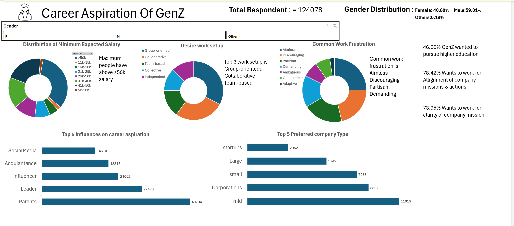
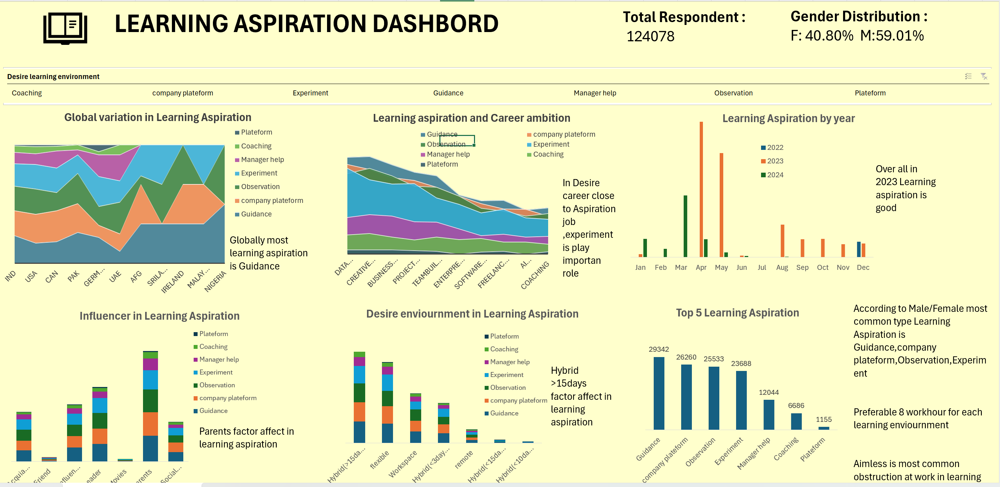
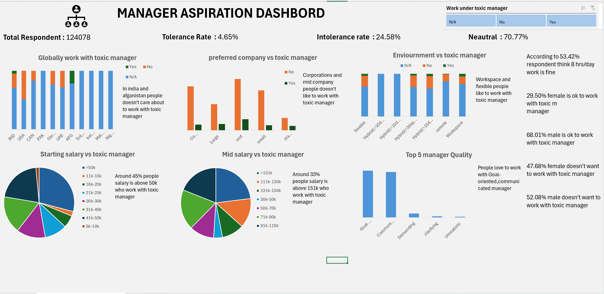

# Data Analyst Internship - GenZ Data Analysis Projects  

## Overview  
During this internship, I worked on multiple projects focusing on GenZ data. These projects involved data cleaning, analysis, and visualization to uncover insights about GenZ's career aspirations, learning preferences, workplace desires, and perceptions of company missions. My primary tools were **Excel** and **SQL**, leveraging advanced functionalities to provide actionable insights.  

---

## Project 1: GenZ Data Standardization and Analysis  

### Objective  
Standardize and analyze GenZ data to uncover key metrics and trends.

### Tools & Techniques  
- **Excel Functions:** Pivot Tables, VLOOKUP, SUMIF, COUNTIF, AVERAGEIF  
- **Data Visualization:** Bar charts, column charts, pie charts  

### Key Deliverables  
- **Data Cleaning:** Standardized GenZ data for analysis by resolving inconsistencies and applying filters for segmentation (e.g., by gender, salary).  
- **KPIs Analyzed:**  
  - Gender distribution  
  - Respondents interested in education abroad and sponsorship  
  - Top influences on career aspirations  
  - Work frustrations segmented by demographics  

---

## Project 2: Career Aspirations Dashboard  

### Objective  
Develop an Excel dashboard to analyze and visualize the career aspirations of GenZ respondents.  

### Tools & Techniques  
- **Excel Dashboarding:** Pivot Tables, slicers, charts  
- **KPI Metrics:** Custom calculations and dynamic filters  

### Key Insights Visualized  
- Top 5 influences on career aspirations  
- Preferred company types  
- Distribution of respondents pursuing higher education  
- Top 3 work setups preferred  
- Alignment and clarity of company missions  
- Minimum expected salary distribution  
- Gender-based insights:  
  - Total respondents  
  - Gender distribution (e.g., 60% Male, 40% Female)  

---

## Project 3: Learning Aspirations Dashboard  

### Objective  
Analyze learning preferences and aspirations of GenZ and identify trends based on geography and time.  

### Tools & Techniques  
- **Advanced Excel Features:** Charts, Pivot Tables, and custom formulas  
- **Dynamic Filters:** Segmentation by geography and month  

### KPIs Analyzed  
- Top learning aspirations of GenZ  
- Variation in aspirations by geography and time  
- Career ambitions versus learning aspirations  
- Influences on learning preferences  
- Desired learning environments (e.g., hybrid, flexible, remote)  

---

## Project 4: Managerial Preferences Dashboard  

### Objective  
Analyze preferences and willingness of GenZ to work under specific conditions, including challenging managerial scenarios.  

### Tools & Techniques  
- **Excel Dashboards:** Interactive slicers, conditional formatting  
- **Advanced Analysis:** Relationship mapping between toxic environments and preferences  

### Insights Uncovered  
- Respondents' willingness to work under abusive managers  
- Remote working preferences by gender  
- Gender-based top work frustrations  
- Impact of toxic managers on company preferences and salary expectations  
- Desired managerial qualities  
- Influence of environment on willingness to work under specific managerial conditions  

---

## Project 5: Mission Aspirations Dashboard  

### Objective  
Explore how GenZ perceives company missions and their alignment with actions.  

### Tools & Techniques  
- **Excel Dashboards:** Visual storytelling with dynamic slicers  
- **Data Segmentation:** Gender and environmental factors  

### KPIs Explored  
- Willingness to work for companies with unclear missions  
- Gender-based perceptions of company missions  
- Alignment of company missions with actions  
- Environmental influences on GenZ's desire to work for specific companies  

---

## Key Skills Demonstrated  

### Excel  
- Data Cleaning and Standardization  
- Advanced Functions: VLOOKUP, SUMIF, COUNTIF, AVERAGEIF  
- Data Visualization: Pivot Tables, charts, dashboards  
- Interactive Filters and Slicers  

# SQL Project: Career Aspiration & Employment Preferences Analysis

## Project Overview

This SQL project analyzes a dataset of respondents from India, focusing on their **career aspirations**, **education preferences**, **work-life balance**, and other factors that influence employment decisions. The dataset includes responses to a survey that explores various aspects of respondents' professional goals, such as salary expectations, career influences, and work preferences. By querying this dataset, the project answers a series of key questions to provide insights into the career priorities, preferences, and gender-based differences among respondents in India.

The main goal of this project is to:

- **Analyze career aspirations** and how these aspirations vary by **gender**.
- Identify the most important factors influencing respondents' decisions to pursue careers, including **education abroad**, **remote working preferences**, and **social impact**.
- Determine respondents' **salary expectations** and **work-life balance** priorities.
- Understand the **work frustrations** and the conditions under which respondents would be willing to work, such as their willingness to work for companies that are socially impactful or under **abusive managers**.

## Key Analysis Questions

The analysis answers several important questions derived from the survey data. These questions cover areas such as gender distribution, career aspirations, salary expectations, and work preferences:

1. **What is the gender distribution** of respondents from India?
2. What **percentage of respondents** from India are interested in **education abroad** and **sponsorship**?
3. What are the **6 top influences on career aspirations** for respondents in India?
4. How do **career aspiration influences** vary by **gender** in India?
5. What **percentage of respondents** are willing to work for a company for at least **3 years**?
6. How many respondents prefer to work for a **socially impactful company**?
7. How does the preference for a **socially impactful company** vary by **gender**?
8. What is the **distribution of minimum expected salary** in the first 3 years among respondents?
9. What is the **expected minimum monthly salary in hand** for respondents?
10. What **percentage of respondents** prefer **remote working**?
11. What is the **preferred number of daily work hours** among respondents?
12. What are the **common work frustrations** faced by respondents?
13. How does the need for **work-life balance intervention** vary by **gender**?
14. How many respondents are willing to work under an **abusive manager**?
15. What is the **distribution of minimum expected salary** after 5 years?
16. What are the **remote working preferences by gender**?
17. What are the **top work frustrations** for each gender?
18. What **factors boost work happiness and productivity** for respondents?
19. What percentage of respondents need **sponsorship for education abroad**?

By running SQL queries against the dataset, we aim to uncover key trends and patterns in the responses, offering valuable insights into the professional priorities and challenges faced by the surveyed respondents.

# sql cleaning project

## Project Overview

This project aims  to clean and preprocess raw data using MySQL. The primary focus was on standardizing data formats, removing unnecessary columns, handling null values, and deleting irrelevant rows. Through these steps, I ensured the dataset was accurate, consistent, and ready for analysis. By leveraging SQL queries, I effectively addressed data quality issues, improving the reliability and usability of the dataset for downstream processes.

# Sales and Customer Dashboard  

## **Introduction**  
This Tableau project combines **Sales Dashboard** and **Customer Dashboard** into a single interactive dashboard. Users can easily switch between the two views to analyze sales performance and customer behavior seamlessly. This integration allows executives, marketers, and managers to derive actionable insights from both sales metrics and customer trends, improving decision-making across the business.  

---

## **Key Features**  

### **1. Sales Dashboard Features**  
- **KPI Overview**:  
  - Summarizes total sales, profits, and quantities for the current and previous years.  
  - Allows year-over-year comparisons to track business growth.  

- **Sales Trends Analysis**:  
  - Monthly trends help identify high and low-performing months.  
  - Dynamic filters enable users to explore specific time frames.  

- **Product Subcategory Comparison**:  
  - Compares sales and profit performance across product subcategories.  
  - Highlights profitable and underperforming categories with visual cues.  

- **Weekly Trends for Sales and Profit**:  
  - Visualizes weekly sales and profit data with average benchmarks.  
  - Highlights outliers to identify weeks with unusual performance.  

---

### **2. Customer Dashboard Features**  
- **KPI Overview**:  
  - Displays the total number of customers, total sales per customer, and total orders for both current and previous years.  
  - Provides an at-a-glance view of customer activity.  

- **Customer Trends Visualization**:  
  - Shows monthly trends for customer activity, including sales, orders, and customer counts.  
  - Identifies high and low-performing months for customer engagement.  

- **Customer Distribution by Orders**:  
  - Segments customers based on the number of orders placed.  
  - Visualizes patterns in customer loyalty and engagement.  

- **Top 10 Customers by Profit**:  
  - Ranks the top 10 profit-generating customers with metrics like sales, profit, order count, and last order date.  
  - Helps identify and focus on high-value customers.  

---

## **Unique Features of the Combined Dashboard**  

- **Integrated Views**:  
  - A navigation button allows users to switch between the Sales Dashboard and Customer Dashboard effortlessly.  
  - Users can analyze both sales and customer data without leaving the interface.  

- **Interactive Filters**:  
  - Filters are applied dynamically across both dashboards for seamless exploration of specific years, months, or product categories.  

- **Unified Design**:  
  - Both dashboards share a consistent layout and design for easy navigation and a better user experience.  

---

## **Purpose**  
This combined dashboard provides a comprehensive platform to:  
- Analyze sales performance and customer behavior in one place.  
- Switch between sales and customer insights for better strategic alignment.  
- Help stakeholders make data-driven decisions quickly and efficiently.  

---

## **Data Sources**  
- **Sales Data**: Historical transaction data for tracking sales, profits, and product performance.  
- **Customer Data**: Customer transaction data for trend analysis and segmentation.  

---

## **How to Use the Dashboard**  

1. **Navigate Between Views**:  
   - Use the switch button to toggle between Sales and Customer dashboards.  

2. **Analyze Sales Performance**:  
   - Explore KPIs, trends, product comparisons, and weekly sales data.  

3. **Understand Customer Behavior**:  
   - Examine KPIs, monthly trends, customer distribution, and the top 10 customers by profit.  

4. **Interactive Exploration**:  
   - Apply filters to focus on specific years, product subcategories, or customer segments.  

---

## **Explore the Dashboard**  
**[Sales & Customer Dashboard on Tableau Public](https://public.tableau.com/app/profile/payal.dhameliya/viz/sales_dashboard_V1_0/salesdashboard)**

---
