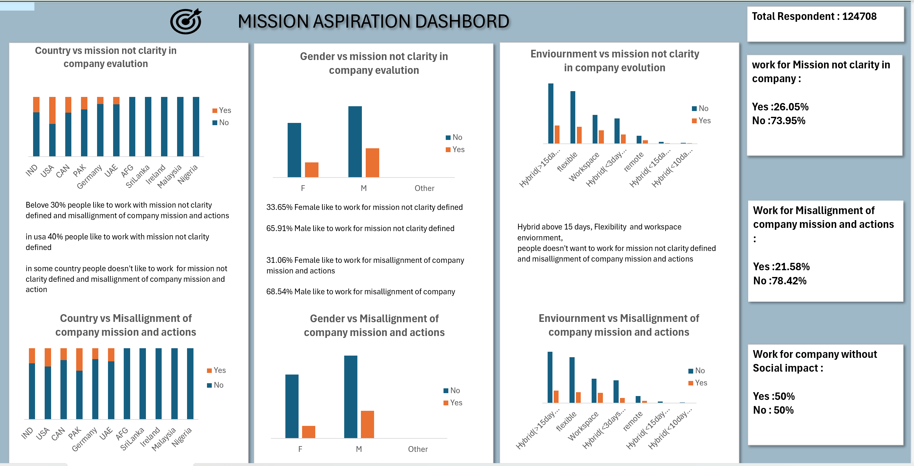

# Data Analyst Internship - GenZ Data Analysis Projects  

## Overview  
During this internship, I worked on multiple projects focusing on GenZ data. These projects involved data cleaning, analysis, and visualization to uncover insights about GenZ's career aspirations, learning preferences, workplace desires, and perceptions of company missions. My primary tools were **Excel** and **SQL**, leveraging advanced functionalities to provide actionable insights.  

---

## Project 1: GenZ Data Standardization and Analysis  

### Objective  
Standardize and analyze GenZ data to uncover key metrics and trends.

### Tools & Techniques  
- **Excel Functions:** Pivot Tables, VLOOKUP, SUMIF, COUNTIF, AVERAGEIF  
- **Data Visualization:** Bar charts, column charts, pie charts  

### Key Deliverables  
- **Data Cleaning:** Standardized GenZ data for analysis by resolving inconsistencies and applying filters for segmentation (e.g., by gender, salary).  
- **KPIs Analyzed:**  
  - Gender distribution  
  - Respondents interested in education abroad and sponsorship  
  - Top influences on career aspirations  
  - Work frustrations segmented by demographics  

---

## Project 2: Career Aspirations Dashboard  

### Objective  
Develop an Excel dashboard to analyze and visualize the career aspirations of GenZ respondents.  

### Tools & Techniques  
- **Excel Dashboarding:** Pivot Tables, slicers, charts  
- **KPI Metrics:** Custom calculations and dynamic filters  

### Key Insights Visualized  
- Top 5 influences on career aspirations  
- Preferred company types  
- Distribution of respondents pursuing higher education  
- Top 3 work setups preferred  
- Alignment and clarity of company missions  
- Minimum expected salary distribution  
- Gender-based insights:  
  - Total respondents  
  - Gender distribution (e.g., 60% Male, 40% Female)  

---

## Project 3: Learning Aspirations Dashboard  

### Objective  
Analyze learning preferences and aspirations of GenZ and identify trends based on geography and time.  

### Tools & Techniques  
- **Advanced Excel Features:** Charts, Pivot Tables, and custom formulas  
- **Dynamic Filters:** Segmentation by geography and month  

### KPIs Analyzed  
- Top learning aspirations of GenZ  
- Variation in aspirations by geography and time  
- Career ambitions versus learning aspirations  
- Influences on learning preferences  
- Desired learning environments (e.g., hybrid, flexible, remote)  

---

## Project 4: Managerial Preferences Dashboard  

### Objective  
Analyze preferences and willingness of GenZ to work under specific conditions, including challenging managerial scenarios.  

### Tools & Techniques  
- **Excel Dashboards:** Interactive slicers, conditional formatting  
- **Advanced Analysis:** Relationship mapping between toxic environments and preferences  

### Insights Uncovered  
- Respondents' willingness to work under abusive managers  
- Remote working preferences by gender  
- Gender-based top work frustrations  
- Impact of toxic managers on company preferences and salary expectations  
- Desired managerial qualities  
- Influence of environment on willingness to work under specific managerial conditions  

---

## Project 5: Mission Aspirations Dashboard  

### Objective  
Explore how GenZ perceives company missions and their alignment with actions.  

### Tools & Techniques  
- **Excel Dashboards:** Visual storytelling with dynamic slicers  
- **Data Segmentation:** Gender and environmental factors  

### KPIs Explored  
- Willingness to work for companies with unclear missions  
- Gender-based perceptions of company missions  
- Alignment of company missions with actions  
- Environmental influences on GenZ's desire to work for specific companies  

---

## Key Skills Demonstrated  

### Excel  
- Data Cleaning and Standardization  
- Advanced Functions: VLOOKUP, SUMIF, COUNTIF, AVERAGEIF  
- Data Visualization: Pivot Tables, charts, dashboards  
- Interactive Filters and Slicers  

# SQL Project: Career Aspiration & Employment Preferences Analysis

## Project Overview

This SQL project analyzes a dataset of respondents from India, focusing on their **career aspirations**, **education preferences**, **work-life balance**, and other factors that influence employment decisions. The dataset includes responses to a survey that explores various aspects of respondents' professional goals, such as salary expectations, career influences, and work preferences. By querying this dataset, the project answers a series of key questions to provide insights into the career priorities, preferences, and gender-based differences among respondents in India.

The main goal of this project is to:

- **Analyze career aspirations** and how these aspirations vary by **gender**.
- Identify the most important factors influencing respondents' decisions to pursue careers, including **education abroad**, **remote working preferences**, and **social impact**.
- Determine respondents' **salary expectations** and **work-life balance** priorities.
- Understand the **work frustrations** and the conditions under which respondents would be willing to work, such as their willingness to work for companies that are socially impactful or under **abusive managers**.

## Key Analysis Questions

The analysis answers several important questions derived from the survey data. These questions cover areas such as gender distribution, career aspirations, salary expectations, and work preferences.For Solution refer this:sql_project/Gen_z_assignment.sql

1. **What is the gender distribution** of respondents from India?
2. What **percentage of respondents** from India are interested in **education abroad** and **sponsorship**?
3. What are the **6 top influences on career aspirations** for respondents in India?
4. How do **career aspiration influences** vary by **gender** in India?
5. What **percentage of respondents** are willing to work for a company for at least **3 years**?
6. How many respondents prefer to work for a **socially impactful company**?
7. How does the preference for a **socially impactful company** vary by **gender**?
8. What is the **distribution of minimum expected salary** in the first 3 years among respondents?
9. What is the **expected minimum monthly salary in hand** for respondents?
10. What **percentage of respondents** prefer **remote working**?
11. What is the **preferred number of daily work hours** among respondents?
12. What are the **common work frustrations** faced by respondents?
13. How does the need for **work-life balance intervention** vary by **gender**?
14. How many respondents are willing to work under an **abusive manager**?
15. What is the **distribution of minimum expected salary** after 5 years?
16. What are the **remote working preferences by gender**?
17. What are the **top work frustrations** for each gender?
18. What **factors boost work happiness and productivity** for respondents?
19. What percentage of respondents need **sponsorship for education abroad**?

By running SQL queries against the dataset, we aim to uncover key trends and patterns in the responses, offering valuable insights into the professional priorities and challenges faced by the surveyed respondents.

